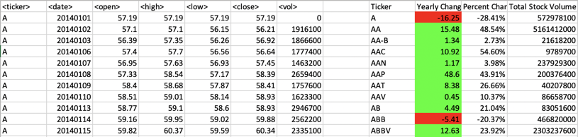

# VBA-challenge
VBA scripting of stock data by Syeda Fasahath Naaz.

## Summary

* Visual Basic Script loops through three years of stock price data.
* The script calculates metrics like total volume, annual change in dollar value, and annual percentage change in dollar value for each of the stocks across all three years.
* The script also locates the stocks with the greatest annual percentage increases in value, greatest annual percentage decreases in value, and greatest total annual volumes.

## Files

* The alphabetical_testing.xlsm file in the "Resources" folder is the test data used for generating the scripts.
* The Multiple_year_stock_data.xlsm file in the "Resources" folder is the stock data on which the scripts were run.
* The StockDataEasy.vbs, StockDataModerate.vbs, StockDataHard.vbs are the Visual Basic Script Files
* The images in the "Screenshots" folder are the images of the Stock Data file after running the above scripts.

## Background

You are well on your way to becoming a programmer and Excel master! In this homework assignment you will use VBA scripting to analyze real stock market data. Depending on your comfort level with VBA, you may choose to challenge yourself with a few of the challenge tasks.

### Before You Begin

1. Create a new repository for this project called `VBA-challenge`. **Do not add this homework to an existing repository**.

2. Inside the new repository that you just created, add any VBA files you use for this assignment. These will be the main scripts to run for each analysis.

### Files

* [Test Data](Resources/alphabetical_testing.xlsx) - Use this while developing your scripts.

* [Stock Data](Resources/Multiple_year_stock_data.xlsx) - Run your scripts on this data to generate the final homework report.

### Stock market analyst

## Instructions

* Create a script that will loop through all the stocks for one year and output the following information.

  * The ticker symbol.

  * Yearly change from opening price at the beginning of a given year to the closing price at the end of that year.

  * The percent change from opening price at the beginning of a given year to the closing price at the end of that year.

  * The total stock volume of the stock.

* You should also have conditional formatting that will highlight positive change in green and negative change in red.

* The result should look as follows.

### CHALLENGES

1. Your solution will also be able to return the stock with the "Greatest % increase", "Greatest % decrease" and "Greatest total volume". The solution will look as follows:

2. Make the appropriate adjustments to your VBA script that will allow it to run on every worksheet, i.e., every year, just by running the VBA script once.

### Other Considerations

* Use the sheet `alphabetical_testing.xlsx` while developing your code. This data set is smaller and will allow you to test faster. Your code should run on this file in less than 3-5 minutes.

* Make sure that the script acts the same on each sheet. The joy of VBA is to take the tediousness out of repetitive task and run over and over again with a click of the button.

## Submission

* To submit please upload the following to Github:

  * A screen shot for each year of your results on the Multi Year Stock Data.

  * VBA Scripts as separate files.

* Ensure your repository has regular commits (i.e. 20+ commits), a thorough README.md file

* After everything has been saved, create a sharable link and submit that to <https://bootcampspot-v2.com/>.

